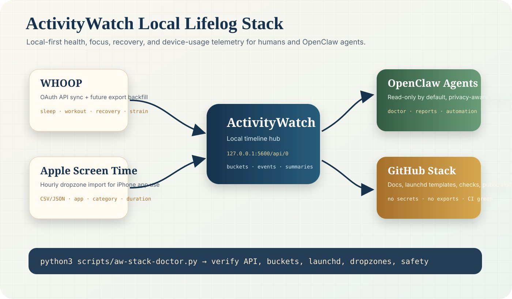
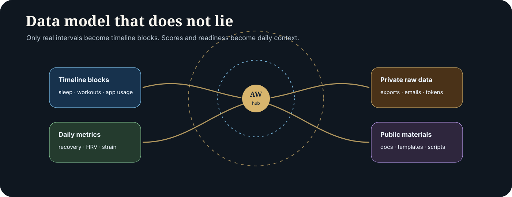

# ActivityWatch Health + Screen Time Stack

<p align="center">
  
</p>

<p align="center">
  <b>Local-first lifelog infrastructure for ActivityWatch, WHOOP, Apple Screen Time, and OpenClaw agents.</b><br>
  Health, recovery, app usage, and focus signals — private by default, automatable by design.
</p>

<p align="center">
  <a href="https://github.com/Martin-Hausleitner/aw-activitywatch-stack/actions"></a>
  <a href="https://github.com/Martin-Hausleitner/aw-importer-whoop"></a>
  <a href="https://github.com/Martin-Hausleitner/aw-importer-apple-screentime"></a>
  
</p>

## What this is

This repo is the **public operating manual and automation layer** for a local ActivityWatch-based health/lifelog stack.

It does not try to put private life data into GitHub. It publishes the safe parts:

- architecture
- installer scripts
- launchd templates
- validation tools
- OpenClaw agent contracts
- privacy rules
- links to importer repos

<p align="center">
  
</p>

## Design principles

- 🧭 **ActivityWatch is the local timeline hub** — no cloud dependency for analysis.
- 🔐 **Private data stays private** — exports, emails, tokens, and raw events are ignored/local only.
- 🧱 **Data model must make sense** — timeline blocks only for real intervals; daily metrics for scores/readiness.
- 🤖 **Agents can help safely** — OpenClaw gets explicit rules, redaction defaults, and verification scripts.
- 🧪 **Every change should verify** — doctor script, CI, secret scan, and launchd status checks.

## System map

- **WHOOP API** → sleep/workout timeline + recovery/strain context
- **Apple Screen Time** → iPhone app-usage timeline
- **ActivityWatch watchers** → Mac app/window/browser/editor activity
- **WHOOP export email** → future targeted backfill path, never broad mailbox crawling
- **OpenClaw agents** → read aggregate local data, update docs/code, never publish private exports

## Quickstart

```bash
git clone https://github.com/Martin-Hausleitner/aw-activitywatch-stack.git
cd aw-activitywatch-stack
python3 scripts/aw-stack-doctor.py
```

Install the hourly Screen Time job:

```bash
scripts/install-local-stack.sh
```

## Agent safety rules

- Do not read broad mailbox history.
- Do not upload or commit health, sleep, workout, email, or app-usage exports.
- Prefer local-only paths and `127.0.0.1`.
- Verify ActivityWatch buckets with `scripts/verify-aw-buckets.py` before reporting success.
- Run `scripts/secret-scan.py` before every push.

## What this repo does not contain

This repo does not contain health exports, Screen Time exports, WHOOP tokens, OAuth secrets, mailbox credentials, or ActivityWatch databases.

## Repo layout

```text
scripts/   Import, verification, validation, and agent helpers
launchd/   macOS LaunchAgent templates
docs/      Privacy, data-source, and OpenClaw operating notes
config/    Non-secret example configuration
```

## Repositories

- WHOOP importer: https://github.com/Martin-Hausleitner/aw-importer-whoop
- Apple Screen Time importer: https://github.com/Martin-Hausleitner/aw-importer-apple-screentime

## Local ActivityWatch buckets

Expected buckets include:

- `aw-importer-whoop-sleep`
- `aw-importer-whoop-workout`
- `aw-importer-whoop-cycle`
- `aw-importer-whoop-recovery`
- `aw-import-screentime_ios_*`

## Recommended model

- WHOOP sleep/workouts: timeline events
- WHOOP recovery/day strain: daily metrics, not noisy timeline blocks
- iPhone Screen Time: app-usage timeline events
- ActivityWatch desktop usage: baseline work timeline


## OpenClaw integration

OpenClaw agents should treat this repo as the operating contract for local ActivityWatch health/lifelog data.

Key docs:

- `docs/openclaw-agent-contract.md` — what agents may inspect, update, publish, or must keep private
- `docs/openclaw-data-ingestion-plan.md` — canonical source and ingestion plan
- `docs/openclaw-agent-safety-contract.md` — explicit agent safety rules
- `docs/data-retention-and-exports.md` — what stays local vs public
- `docs/activitywatch-data-model.md` — bucket and event semantics
- `docs/operations.md` — local runbook and repair checklist
- `docs/data-sources.md` — WHOOP, Screen Time, ActivityWatch, and future daily summary model
- `docs/whoop-export-email-policy.md` — privacy-safe targeted email export discovery

Useful commands:

```bash
python3 scripts/aw-health-report.py
python3 scripts/secret-scan.py
```

## Autostart jobs

This repo ships templates in `launchd/`.

Local install should copy scripts to:

```text
~/Library/Application Support/aw-activitywatch-stack/
```

and launchd plists to:

```text
~/Library/LaunchAgents/
```

Jobs:

- `ai.servas.aw-whoop-sync` runs WHOOP sync continuously every 15 minutes internally.
- `ai.servas.aw-screentime-hourly` runs once per hour and imports new CSV/JSON files from:
  `~/ActivityWatchImports/screentime/`

## Screen Time hourly sync

Put exports here:

```text
~/ActivityWatchImports/screentime/
```

Accepted formats:

- `.csv`
- `.json`

Already imported files are tracked by SHA-256 in local state:

```text
~/Library/Application Support/aw-activitywatch-stack/screentime-imported-files.txt
```


## Install launchd jobs

Screen Time hourly sync example:

```bash
mkdir -p "$HOME/Library/Application Support/aw-activitywatch-stack"
mkdir -p "$HOME/Library/Logs/aw-activitywatch-stack"

cp scripts/sync-screentime-folder.sh "$HOME/Library/Application Support/aw-activitywatch-stack/"
cp launchd/ai.servas.aw-screentime-hourly.plist.template \
  "$HOME/Library/LaunchAgents/ai.servas.aw-screentime-hourly.plist"

sed -i '' "s#/Users/YOU#$HOME#g" \
  "$HOME/Library/LaunchAgents/ai.servas.aw-screentime-hourly.plist"

launchctl bootstrap "gui/$UID" "$HOME/Library/LaunchAgents/ai.servas.aw-screentime-hourly.plist"
launchctl kickstart -k "gui/$UID/ai.servas.aw-screentime-hourly"
```

Unload:

```bash
launchctl bootout "gui/$UID/ai.servas.aw-screentime-hourly"
```

## WHOOP credentials

Never commit secrets.

The local WHOOP job should read:

- client id from local script/env
- client secret from macOS Keychain
- refresh/access tokens from the WHOOP importer's local config dir

## WHOOP export emails

See `docs/whoop-export-email-policy.md`.

Important: agents must not broadly fetch mailboxes. They should only fetch messages matching the confirmed WHOOP export email pattern.

## Verify

```bash
curl -fsS http://127.0.0.1:5600/api/0/info
python3 scripts/verify-aw-buckets.py
```

## Current local status

A healthy local setup should show:

- ActivityWatch server on `127.0.0.1:5600`
- WHOOP import buckets for sleep/workout/cycle/recovery
- Apple Screen Time buckets named `aw-import-screentime_ios_*`
- hourly Screen Time launchd job: `ai.servas.aw-screentime-hourly`
- continuous WHOOP launchd job: `ai.servas.aw-whoop-sync`
```

## Security

Do not commit:

- tokens
- client secrets
- exported health/screen-time files
- `.eml` / `.em1` samples
- mailbox config
- logs containing private app usage
